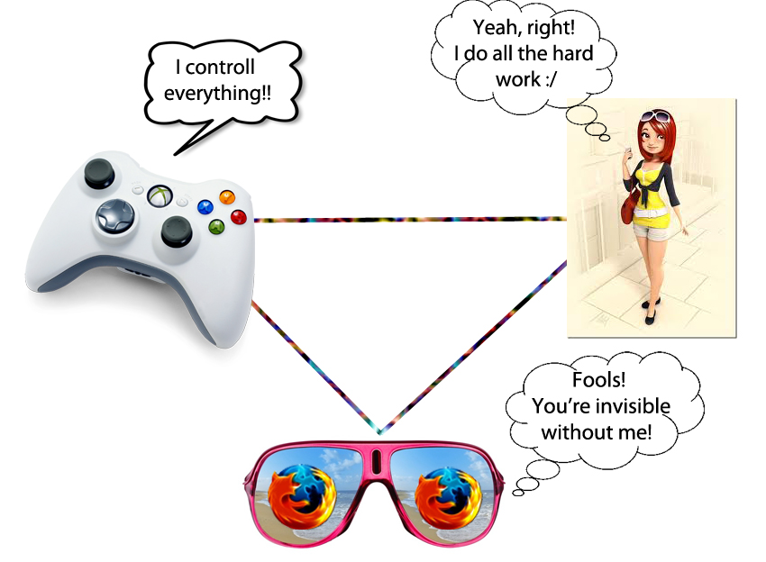

# Layouts and Rendering in Rails

## 1 Model-View-Controller trougao

## 2 Kreiranje odgovora

Sa tačke gledišta kontrolera, HTTP odgovor se može kreirati na tri načina:

  1. **render** -  kreira pun odgovor koji se šalje nazad pretraživaču
  2. **redirect** - šalje HTTP redirect status kod pretraživaču
  3. **head** - kreira odgovor koji se sastoji samo od HTTP hedera i šalje pretraživaču

### 2.1 Podrazumijevano generisanje prikaza 

Rails promoviše stav ,,konvencija prije konfiguracije", pa je generisanje podrazumijevanog prikaza odličan primjer ovakve logike. Kontroleri automatski generišu view koji odgovara validnoj ruti. 

    class BooksController < ApplicationController
    end

Dodamo sledeću liniju u routes fajl:

    resources :books

Imamo view fajl app/views/books/index.html.erb:

    <h1>Books are coming soon!</h1>

Rails ce autotamski generisati prikaz **app/views/books/index.html.erb** kada odemo na /books i na ekranu će se prikazati poruka:

  **Books are coming soon!**

Kako nam ova poruka ne znaci mnogo, uskoro ćemo dodati index metod našem modelu, pa će Rails, ukoliko eksplicitno ne generišemo neki drugi prikaz, uvijek tražiti app/views/books/index.html.erb u putanjama vidljivim kontroleru, generisati taj prikaz.

    class BooksController < ApplicationController
      def index
        @books = Book.all
      end
    end

Sada nam je promjenljiva **books** dostupna u **app/views/books/index.html.erb** fajlu, a ovo bi bio neki njegov uobičajeni kod:

	<h1>Listing Books</h1>
	 
	<table>
	  <tr>
	    <th>Title</th>
	    <th>Summary</th>
	    <th></th>
	    <th></th>
	    <th></th>
	  </tr>
	 
	<% @books.each do |book| %>
	  <tr>
	    <td><%= book.title %></td>
	    <td><%= book.content %></td>
	    <td><%= link_to "Show", book %></td>
	    <td><%= link_to "Edit", edit_book_path(book) %></td>
	    <td><%= link_to "Remove", book, method: :delete, data: { confirm: "Are you sure?" } %></td>
	  </tr>
	<% end %>
	</table>
	 
	 
	 
	<%= link_to "New book", new_book_path %>

Generisanje prikaza rade potklase [**ActionView::TemplateHandleres**](http://api.rubyonrails.org/classes/ActionView/Template/Handlers/ERB.html), i od njih zavisi koje će biti ekstenzije naših view controller fajlova.

### 2.2 render

U većini slučajeva, metod koji radi najteže stvari pri generisanju prikaza sadržaja aplikacije je **ActionController::Base#render**.

Ako želimo da vidimo tačne rezultate poziva render, može da se generiše prikaz stringa. Podržava iste opcije kao običan render, samo što vraća string umjesto slanja odgovora nazad pretraživaču. 

    render_to_string

#### 2.2.1 Generisanje ničega

Najjednostavnija stvar koji možemo da generišemo je ništa:

    render nothing: true

Ako iskoristimo cURL da provjerimo odgovor, vidjećemo:

    $ curl -i 127.0.0.1:3000/books
    HTTP/1.1 200 OK
    Connection: close
    Date: Sun, 24 Jan 2010 09:25:18 GMT
    Transfer-Encoding: chunked
    Content-Type: */*; charset=utf-8
    X-Runtime: 0.014297
    Set-Cookie: _blog_session=...snip...; path=/; HttpOnly
    Cache-Control: no-cache 

Obično se koristi kod Ajax zahtjeva kada želimo da damo do znanja pretraživaču da je zahtjev ispunjen. 

#### 2.2.2 Generisanje prikaza Action's View-a

Ako želimo da generišemo view koji odgovara drugačijem šablonu u istom kontroleru, moramo navesti i njegovo ime:

    def update
      @book = Book.find(params[:id])
      if @book.update(params[:book])
        redirect_to(@book)
      else
        render "edit"
      end
    end

Ako update omane, biće generisan šablon edit.html.erb  koji pripada istom kontroleru. 
Umjesto stringa **edit** može se koristiti i simbol **:edit**.

#### 2.2.3 Generisanje prikaza šablona akcije tuđeg kontrolera

    render "products/show"
    ili
    render template: "products/show"

Adresa je relativna u odnosu na **app/views**.

#### 2.2.4 Generisanje prikaza šablona proizvoljnog fajla

    render "/u/apps/warehouse_app/current/app/views/products/show"
    ili
    render file:  "/u/apps/warehouse_app/current/app/views/products/show"

Podrazumijeva se da će se fajl prikazati bez korišćenja trenutnog layout-a. Ako želimo da ga uključimo, treba da dodamo opciju 
    
    layout: true option

#### 2.2.5 Sumiranje

Sledeće linije generišu prikaz istog fajla:

    render :edit
    render action: :edit
    render "edit"
    render "edit.html.erb"
    render action: "edit"
    render action: "edit.html.erb"
    render "books/edit"
    render "books/edit.html.erb"
    render template: "books/edit"
    render template: "books/edit.html.erb"
    render "/path/to/rails/app/views/books/edit"
    render "/path/to/rails/app/views/books/edit.html.erb"
    render file: "/path/to/rails/app/views/books/edit"
    render file: "/path/to/rails/app/views/books/edit.html.erb"

#### 2.2.6 Generisanje prikaza sa :inline

    render inline: "<% products.each do |p| %>
<%= p.name %>
<% end %>"

Na ovaj način može se generisati prikaz bez fajla, ali se ovo nikako ne preporučuje. 

Podrazumijevano je da  inline generisanje prikaza koristi ERB. Ovo se može promijeniti opcijom **type**.

    render inline: "xml.p {'Horrid coding practice!'}", type: :builder

#### 2.2.7 Generisanje teksta

    render text: "OK"

Koristi se kada Ajax zathev očekuje nešto što nije uobičajen html tekst. 
Što se layout-a tiče, važi isto što i kod fajlova. 

#### 2.2.8 Generisanje JSON prikaza

JSON je JavaScript format podataka koji koriste mnoge Ajax bibloiteke. Rails ima ugrađenu podršku za pretvaranje objekata u JSON i generisanje prikaza tih JSON-a u pretraživaču:

    render json: @product

Ne morate da pozovete to_json nad objektom koji čiji prikaz želimo da generišemo. Json opcija radi to automtski. 

#### 2.2.9 Generisanje XML prikaza

Ista stvar važi i za XML. 

    render xml: @product

#### 2.2.10 Generisanje Vanilla JavaScript prikaza

    render js: "alert('Hello Rails');"

Ovo će poslati string koji je argument pretraživaču sa MIME tipom teksta/javascript-a. 

#### 2.2.11 Opcije za generisanje prikaza

    :content_type
    :layout
    :location
    :status

##### 2.2.11.1 :content_type 

Podrazumijevano je da će Rails predstaviti rezultate operacije generisanja prikaza u MIME verziji teksta/html-a. Ako želimo to da promijenimo, možemo koristiti liniju: 

    render file: filename, content_type: "application/rss"

##### 2.2.11.2 :layout opcija

Da bi generisali prikaz u određenom layout-u: 

    render layout: "special_layout"

Da se otarasimo layout-a: 

    render layout: false

##### 2.2.11.3 :location opcija

Možemo koristiti ovu opciju da podesimo HTTP Location zaglavlje:

  render xml: photo, location: photo_url(photo)

##### 2.2.11.4 :status opcija

Rails će automatski generisati odgovor sa korektnim HTTP status kodom (obično je 200 OK). Možemo to promijeniti:

    render status: 500
    render status: :forbidden

[Tabela status kodova](http://guides.rubyonrails.org/layouts_and_rendering.html#the-status-option" "tabela status kodova")

#### 2.2.12 traženje layout-a

Da bi pronašao trenutni layout, Rails će prvo potražiti u fajl pod imenom kontrolera u osnovi, i to u folderu app/views/layouts. Ako ne postoji takav, Rails će koristiti **app/views/layouts/application.html.erb** ili **app/views/layouts/application.builder**. Ako nema  .erb layout-a, Rails će koristiti .builder layout, ukoliko postoji. Na sreću, Rails omogućava još nekoliko načina da tačno dodijelite određene layout-e kontrolerima i akcijama.

##### 2.2.12.1 Određivanje layout-a za kontrolere

Podrazumijevani layout se zanemaruje na sledeći način:

    class ProductsController < ApplicationController
      layout "inventory"
      #...
    end

Nakon ove deklaracije, svi prikazi generisani od strane proizvod kontrolera koristiće **app/views/layouts/inventory.html.erb** kao svoj layout. 
Da bi dodijelili specifičan layout cijeloj aplikacijij, korsitimo: 

    lass ApplicationController < ActionController::Base
      layout "main"
      #...
    end

##### 2.2.12.2 Biranje layout-a tokom pokretanja

Moguće je koristiti simbol radi odlaganja izbora layout-a sve dok se zahtjev obražuje: 

    class ProductsController < ApplicationController
      layout :products_layout
     
      def show
        @product = Product.find(params[:id])
      end
     
      private
        def products_layout
          @current_user.special? ? "special" : "products"
        end
     
    end

Može se koristiti inline metod, čak i Proc: 

    class ProductsController < ApplicationController
      layout Proc.new { |controller| controller.request.xhr? ? "popup" : "application" }
    end

xml_http_request?

##### 2.2.12.3 Uslovni Layout-i

Layout-i specificirani na nivou kontrolera podržavaju **:only** i **:except** opcije. Ove opcije uzimaju ili ime metoda ili niz imena metoda:

    class ProductsController < ApplicationController
      layout "product", except: [:index, :rss]
    end

Deklarisan na ovaj način, product layout bi se koristio za sve osim za rss i index metode. 

#### 2.2.12.4 Nasleđivanje layout-a

Specifičnije layout deklaracije uvijek ponište one generalnije.  

    application_controller.rb
    class ApplicationController < ActionController::Base
      layout "main"
    end

    posts_controller.rb
    class PostsController < ApplicationController
    end

    special_posts_controller.rb
    class SpecialPostsController < PostsController
      layout "special"
    end

    old_posts_controller.rb
    class OldPostsController < SpecialPostsController
      layout false
     
      def show
        @post = Post.find(params[:id])
      end
     
      def index
        @old_posts = Post.older
        render layout: "old"
      end
      # ...
    end

  - Generalno, pregled će biti generisan u layout-u main.     
  - PostsController#index će koristiti main layout.
  - SpecialPostsController#index će koristiti special layout
  - OldPostsController#show neće korisiti layout. 
  - OldPostsController#index će koristiti old layout

#### 2.2.13 Izbjegavanje grešaka generisanja duplih prikaza

Prije ili kasnije, većina Rails progamera će se susresti sa porukom: ,,Can only render or redirect once per action."

    def show
      @book = Book.find(params[:id])
      if @book.special?
        render action: "special_show"
      end
      render action: "regular_show"
    end

Evo zakrpljene verzije:

    def show
      @book = Book.find(params[:id])
      if @book.special?
        render action: "special_show" and return
      end
      render action: "regular_show"
    end

Ne koristiti &&return jer neće raditi zbog prioriteta operatora u Ruby-ju. 

Važno je primijetiti da implicitno generisanje prikaza od strane ActionController-a detektuje da li je generisanje prikaza pozvano, tako da će i ovo raditi bez grešaka:

    def show
      @book = Book.find(params[:id])
      if @book.special?
        render action: "special_show"
      end
    end

Ovdje će specijalne knjige biti prikazane uz pomoć special_show šablona, a ostale uz pomoć default show šablona. 

### 2.3 redirect_to

Još jedan način da se obrade odogovra na HTTP zahtjev je **redirect_to**. 
Render govori Rails-u koji prikaz da koristi pri kreiranju odgovora. 
Redirect_to metod radi nešto potpuno drugačije: govori pretraživaču da pošalje novi zahtjev za drugi URL. 

Redirect_to može da se koristi sa bilo kojim argumentom koji bi mogao da se koristi sa **link_to** ili **url_for**. 

Specijalni zahtjev koji šalje korisnike nazad na stranicu sa koje su došli je: 

    redirect_to :back

#### 2.3.1 Dobijanje drugačijeg redirect status koda 

Rails koristi HTTP status kod 302, privremeni redirekt, kako pozovete redirect_to. Ako bi to da mijenjate, možda na 301 (trajni redirekt), koristite :status opciju:

    redirect_to photos_path, status: 301

Kao i render, redirect_to prihvata numeričke i simboličke oznake. 

### 2.3.2 Razlika između render i redirect_to 

Ponekad neiskusni programeri vide redirect_to kao goto komandu, koja pomjera izvršavanje koda s jednog mjesta na drugo. To je netačno. Izvršavanje koda se zaustavlja i čeka se novi zahtjev za pretraživača. Samo se dešava da ste rekli pretraživaču koji zahtjev bi trebalo da bude sledeci time što ste poslali HTTP 302 status kod. 

    def index
      @books = Book.all
    end
     
    def show
      @book = Book.find_by(id: params[:id])
      if @book.nil?
        render action: "index"
      end
    end

Ako je @book nil, doći će do problema. 
render :action ne pokreće ništa od koda odredišne akcije, tako da ništa neće setovati @books promjenljivu koju će index vjerovatno zahtijevati. Jedan način da se ovo popravi je da koristimo redirect_to umjesto render:

    def index
      @books = Book.all
    end
     
    def show
      @book = Book.find_by(id: params[:id])
      if @book.nil?
        redirect_to action: :index
      end
    end

Ovim kodom će pretraživač poslati svjež zahtjev za index stranu,kod u index metodu će se pokrenuti i sve će biti dobro. 

Jedini nedostatak ovog koda je to što zahtijeva povratan put do pretraživača: pretraživač zahtijeva show akciju sa **books/1** i kontroler vidi da nema knjiga, pa kontroler salje 302 redirekt odgovor pretraživaču i traži /books/. Pretraživač posluša i pošalje novi zahtjev nazad kontroleru tražeći index akciju. Tada kontroler dohvati sve knjige u bazi i generiše prikaz index šablon. Sve šalje nazad pretraživaču koji onda to prikazuje na ekranu.

Sledeći primjer će malo ubrzati dobijanje odgovora:

    def index
      @books = Book.all
    end
     
    def show
      @book = Book.find_by(id: params[:id])
      if @book.nil?
        @books = Book.all
        flash.now[:alert] = "Your book was not found"
        render "index"
      end
    end

Detektovaćemo ako nema kljige sa određenim id-jem, inicijalizovati @books promjenljivu i direktno generisati prikaz **index.html.erb** šablona, vraćajući pretraživaču poruku o tome šta se desilo. 

### 2.4 Korišćenje head-a za pravljenje Header-Only odgovora

Head metod se može koristiti kao očiglednija alternativa za render :nothing. 
Prihvata broj ili simbol kao argument koji predstavlja HTTP status kod. Može imati i opcije koje se interpretiraju kao heš imena i vrijednosti zaglavlja. 

    head :bad_request

Dobili bi sledeće zaglavlje:

    HTTP/1.1 400 Bad Request
    Connection: close
    Date: Sun, 24 Jan 2010 12:15:53 GMT
    Transfer-Encoding: chunked
    Content-Type: text/html; charset=utf-8
    X-Runtime: 0.013483
    Set-Cookie: _blog_session=...snip...; path=/; HttpOnly
    Cache-Control: no-cache

Ili dodatno: 

    head :created, location: photo_path(@photo)

Dobijamo:

    HTTP/1.1 201 Created
    Connection: close
    Date: Sun, 24 Jan 2010 12:16:44 GMT
    Transfer-Encoding: chunked
    Location: /photos/1
    Content-Type: text/html; charset=utf-8
    X-Runtime: 0.083496
    Set-Cookie: _blog_session=...snip...; path=/; HttpOnly
    Cache-Control: no-cache

## 3 Struktuiranje Layouts-a

Unutar layout-a imate možete koristiti tri alatke za kombinovanje djelova izlaza, u cilju dobijanja sveobuhvatnog odgovora:

  1. Asset tags
  2. yield and content_for
  3. Partials

### 3.1 Asset Tag Helpers

Postoji šest asset tag helpera dostupnih u Rails-u:

  1. auto_discovery_link_tag
  2. javascript_include_tag
  3. stylesheet_link_tag
  4. image_tag
  5. video_tag
  6. audio_tag

Možete ih koristiti u layout-ima ili drugim view-ovima, iako se auto_discovery_link_tag, javascript_include_tag i stylesheet_link_tag obično koriste u zaglavlju layout-a.

Asset tag helperi ne provjeravaju da li postoji asset na lakaciji koju ste priložili; jednostavno pretpostavljaju da znate šta radite i generišu link. 

#### 3.1.1 Linkovanje Feeds-a sa auto_discovery_link_tag-om

Auto_discovery_link_tag helper pravi HTML koji mnogi pretraživači i novine mogu da koriste da detektuju prisustvo RSS ili Atom feeds-a- Uzima tip linka (:rss ili :atom), heš opcija koje su proslijeđene kroz url_for i heš opcija za tag: 

    <%= auto_discovery_link_tag(:rss, {action: "feed"},
      {title: "RSS Feed"}) %>

Postoje tri opcije koje su dostupne za auto_discovery_link_tag:

  1. **:rel** određuje rel vrijednost lika. Podrazumijevana vrijednost je ,,alternate" 
  2. **:type** određuje eksplicitni MIME tip. Rails će generisati odgovarajući tip automatski.
  3. **:title** određuje naslov linka. Podrazumijevana vrijednost je (velikim slovima) :type value ("ATOM" ili "RSS").

#### 3.1.2 Linkovanje JavaScript fajlova sa javascript_include_tag-om

Ako koristimo Rails sa omogućenim Asset Pipeline-om,  ovaj helper će generisati link za **/assets/javascripts/** prije nego **public/javascripts** kao u ranijim verzijama. 

JavaScript fajl unutar Rails aplikacije se čuva na jednoj od ove tri lokacije: **app/assets**, **lib/assets** ili **vendor/assets**

Moguće je navesti punu putanju u odnosu na osnovni dokument, ili URL. 

    <%= javascript_include_tag "main" %>

Rails će napraviti izlazni tag na sledeći način: 

    

Zahtjev ka ovom asset-u se dalje obrađuje gemom Sprocket.

Za uključivanje više fajlova kao što su **app/assets/javascripts/main.js** i **app/assets/javascripts/photos/columns.js** istovremeno:

    <%= javascript_include_tag "main", "/photos/columns" %>

Za uključivanje http://example.com/main.js:

    <%= javascript_include_tag "http://example.com/main.js" %>

### 3.1.3 Linkovanje CSS Fajlova sa stylesheet_link_tag-om

Stylesheet_link_tag helper vraća HTML <link> tag za dati izvor .

Čuvanje i obrada css fajlova su isti kao i kod javascript-a. Isto važi i za navođenje putanje. 

Da uključite  **app/assets/stylesheets/main.css** i **app/assets/stylesheets/columns.css**:

    <%= stylesheet_link_tag "main", "columns" %>

Da uključite  **app/assets/stylesheets/main.css** i **app/assets/stylesheets/photos/columns.css**:

    <%= stylesheet_link_tag "main", "photos/columns" %>

Da uključite http://example.com/main.css:

    <%= stylesheet_link_tag "http://example.com/main.css" %>

Podrazumijevano je da stylesheet_link_tag kreira link sa media="screen" rel="stylesheet". Ovo se može promijeniti:

    <%= stylesheet_link_tag "main_print", media: "print" %>

### 3.1.4 Linkovanje slika sa image_tag-om

Image_tag helper pravi HTML  tag za određeni fajl. Podrazumijevano je da se fajlovi učitavaju iz public/images.

Mora se navesti i ekstenzija slike!

    <%= image_tag "header.png" %>

Možete navesti i putanju do slike:

    <%= image_tag "icons/delete.gif" %>

Možete navesti i heš dodatnih HTML opcija: 

    <%= image_tag "icons/delete.gif", {height: 45} %>

Možete navesti i alt tekst, u slučaju da se slika ne prikaže:

    <%= image_tag "home.gif" %>
    <%= image_tag "home.gif", alt: "Home" %>

S obzirom na to da je ovakav alt tag podrazumijevan, gornje dvije linije bi dale iste alt tag.

Možete takođe navesti i specijalni size tag, u formatu"{width}x{height}":

    <%= image_tag "home.gif", size: "50x20" %>

Dodatno, možete dodati i poslednji heš standardnih HTML opcija:

    <%= image_tag "home.gif", alt: "Go Home",
                          id: "HomeImage",
                          class: "nav_bar" %>

### 3.1.5 Linkovanje Videa sa the video_tag-om

Video_tag helper pravi HTML 5 video tag.Podrazumijevano je da su fajlovi učitani iz public/videos foldera. 

    <%= video_tag "movie.ogg" %>

Pravi: 

    <video src="/videos/movie.ogg" />

Sve što važi za putanje i opcije kod slike važi i za video. 

Video tag takođe podržava sve video HTML opcije kroz  HTML heš opcija, uključujući i:

    poster: "image_name.png", navodi sliku koja će biti na mjestu videa dok ga ne pustimo
    autoplay: true, pušta video kad se stranica učita
    loop: true, ponovo pušta video kad se završi
    controls: true, obezbjeđuje kontrole kao što su play/start/stop...
    autobuffer: true, fajl će biti učitan zajedno sa stranom

Može se takođe navesti čitav niz videa: 

    <%= video_tag ["trailer.ogg", "movie.ogg"] %>

To će napraviti:

    <video><source src="trailer.ogg" /><source src="movie.ogg" /></video>

### 3.1.6 Linkovanje Audio Fajlova sa audio_tag-om

Audio_tag helper pravi HTML 5 audio tag.Podrazumijevano je da se fajlovi učitavaju iz public/audios foldera. 

    <%= audio_tag "music.mp3" %>

Može se takođe navesti i putanja do videa:

    <%= audio_tag "music/first_song.mp3" %>

Opcije sa hešom takođe važe i ovdje, kao i specijalne opcije:

    :autoplay
    :controls 
    :autobuffer

### 3.2 Yield

Yield određuje sekciju gdje treba umentuti sadržaj iz vjew-a. Najjednostavniji način je koristiti jedan yield u koji se umeće čitav sadržaj čiji se prikaz generiše. 

    <html>
      <head>
      </head>
      <body>
      <%= yield %>
      </body>
    </html>

Može se kreirati layout u kom se poziva više yield-ova:

    <html>
      <head>
      <%= yield :head %>
      </head>
      <body>
      <%= yield %>
      </body>
    </html>

Glavni dio view-a će se uvijek generisati tamo gdje se poziva neimenovani yield. Da bi se generisao prikaz sadržaja imenovanog yield-a koristi se content_for metod. 

### 3.3 Content_for

Content_for metod omogućava da umetnete sadržaj u imenovan yield blok u layout-u. Na primjer,ovaj view bi radio sa layoutom koji smo upravo vidjeli:

    <% content_for :head do %>
      <title>A simple page</title>
    <% end %>
     
    
Hello, Rails!

The result of rendering this page into the supplied layout would be this HTML:

    <html>
      <head>
      <title>A simple page</title>
      </head>
      <body>
      
Hello, Rails!

      </body>
    </html>

content_for meotd je veoma koristan kada layout sadrži različite regije kao što su futeri, zaglavlja, koji bi trebalo da imaju svoje blokove. Takođe je koristan za umetanje tagova koji učitavaju specifična stranična JavaScript ili css u zaglavlje ili neki generički layout. 

### 3.4 Partials

Partial šabloni su još jedan način razbijanja procesa generisanja prikaza u djelove kojima se lakše barata. Sa partial-om možemo da pomjerimo kod za generisanje prikaza određenog dijela poziva u njegov sopstveni fajl. 

#### 3.4.1 Imenovanje Partial-a

Da bi generisali prikaz partial-a nekog view-a, koristimo render metod unutar view-a:

    <%= render "menu" %>

Ovo će generisati prikaz fajla pod imenom **_menu.html.erb**. Obratiti pažnju na način imenovanja ovih fajlova i njihovo pozivanje. Mogu se pozvati i partial-i iz drugog fajla:

    <%= render "shared/menu" %>

Ovaj kod će povući partial iz app/views/shared/_menu.html.erb.

#### 3.4.2 Pojednostavljivanje view-a uz pomoć partial-a

Jedan način da koristite partial-e je da ih tretirate kao ekvivalent podrutina: kao način da izbacujete detalje iz view-a tako da možete lakše da shvatite šta se dešava. Možete, na primjer, imati view koji izgleda ovako:

    <%= render "shared/ad_banner" %>
     
    <h1>Products</h1>
     
    
Here are a few of our fine products:

    ...
     
    <%= render "shared/footer" %>

Ovdje bi **_ad_banner.html.erb** i **_footer.html.erb** mogli da sadrže kod koji je dijele mnoge stranice aplikacije. Ne treba u ovom trenutku da vidite detalje ovih sekcija i koncentrišete se na određenu stranu. 

#### 3.4.3 Layout-i partial-a

Partial može da koristi svoj layout fajl, kao što view koristi layout. Mogli bi da pozovemo partial ovako:

    <%= render partial: "link_area", layout: "graybar" %>

Ovo bi pozvalo partial **_link_area.html.erb** i generisalo prikaz pomoću layout-a **_graybar.html.erb**.Primijetite da imena ovih layout fajlova prate ista pravila imenovanja kao i sami partial-i i da se nalaze u istom folderu kao i partial-i kojima pripadaju. 

Takođe se mora eksplicitno navesti **:partial** kada koristimo dodatne opcije. 

#### 3.4.4 Prosleđivanje lokalnih promjenljivih

Parial-ima se mogu proslijediti i lokalne promjenljive, što ih čini moćnijim i fleksibilnijm. Možete koristiti ovu tehniku da smanjite dupliranje koje se sreće kod new i edit stranica: 

    new.html.erb
    <h1>New zone</h1>
    <%= error_messages_for :zone %>
    <%= render partial: "form", locals: {zone: @zone} %>

    edit.html.erb
    <h1>Editing zone</h1>
    <%= error_messages_for :zone %>
    <%= render partial: "form", locals: {zone: @zone} %>

    _form.html.erb
    <%= form_for(zone) do |f| %>
      

        <b>Zone name</b> 
        <%= f.text_field :name %>
      

      

        <%= f.submit %>
      

    <% end %>

Iako će prikaz istih partial-a biti generisan u oba view-a, Action View submit helper će vratiti "Create Zone" za new i "Update Zone" za edit akciju.  

Svaki partial takođe ima i lokalnu promjenljivo koja ima isto ime kao i on (minus "_"). Ovoj lokalnoj promjenljivoj se može i proslijediti objekat:

    <%= render partial: "customer", object: @new_customer %>

#### 3.4.5 Generisanje prikaza kolekcija

Partial-i su veoma korisni pri generisanju prikaza kolekcija. Kada proslijedite kolekciju partial-u preko :collection opcije, partial će biti unešen jednom za svakog člana te kolekcije:

    index.html.erb
    <h1>Products</h1>
    <%= render partial: "product", collection: @products %>

    _product.html.erb
    
Product Name: <%= product.name %>

Pretpostavimo da je @products kolekcija instanci proizvoda, tako da možemo da pojednostavimo kod tako što ćemo ovo upisati u index.html.erb fajl:

    <h1>Products</h1>
    <%= render @products %>

Rails određuje ime partiala koje će koristiti preko imena modela u kolekcijij. 

    index.html.erb
    <h1>Contacts</h1>
    <%= render [customer1, employee1, customer2, employee2] %>

    customers/_customer.html.erb
    
Customer: <%= customer.name %>

    employees/_employee.html.erb
    
Employee: <%= employee.name %>

Rails će koristiti customer ili employee partial-e kako naizmjenično. 

U slučaju da je kolekcija nil, dodaje se alternativna opcija:

    <h1>Products</h1>
    <%= render(@products) || "There are no products available." %>

#### 3.4.6 Lokalne promjenljive

Za korišćenje drugačijeg imena lokalnih promjenljivih koristi se opcija :as:

    <%= render partial: "product", collection: @products, as: :item %>

Može se i proslijediti proizvoljna lokalna promjenljiva bilo kom partial-u čiji prikaz generišete:

    <%= render partial: "products", collection: @products,
           as: :item, locals: {title: "Products Page"} %>

Generiše se prikaz _products.html.erb-a za svaku instancu product-a.

Rails pravi i brojač promjenljivih. 
Ako generišemo prikaz @products, unutar partial-a se može pozvati product_counter koji će reći koliko puta je prikaz tog partial-a bio generisan. Ovo ne radi sa as: opcijom. 

#### 3.4.7 Spacer šabloni

    <%= render partial: @products, spacer_template: "product_ruler" %>

Rails će generisati prikaz _product_ruler partial-a između svakog para _product partial-a. 

#### 3.4.8 Collection Partial Layouts

    <%= render partial: "product", collection: @products, layout: "special_layout" %>

Layout će biti generisan zajedno sa partial-om za svaku artikal u kolekciji. Current objekat i object_counter će biti dostupni u layout-u i u pratial-u. 

### 3.5 Ugniježdeni Layout-i

Kada u aplikaciji morate da koristite layout-e koji se malo razlikuju, bolje ih je ugnijezditi nego mijenjati.

    app/views/layouts/application.html.erb
    <html>
    <head>
      <title><%= @page_title or "Page Title" %></title>
      <%= stylesheet_link_tag "layout" %>
      
    </head>
    <body>
      
Top menu items here

      
Menu items here

      
<%= content_for?(:content) ? yield(:content) : yield %>

    </body>
    </html>

Na stranama koje NewsController generiše želimo da sakrijemo top menu i dodamo right menu:

    app/views/layouts/news.html.erb
    <% content_for :stylesheets do %>
      #top_menu {display: none}
      #right_menu {float: right; background-color: yellow; color: black}
    <% end %>
    <% content_for :content do %>
      
Right menu items here

      <%= content_for?(:news_content) ? yield(:news_content) : yield %>
    <% end %>
    <%= render template: "layouts/application" %>